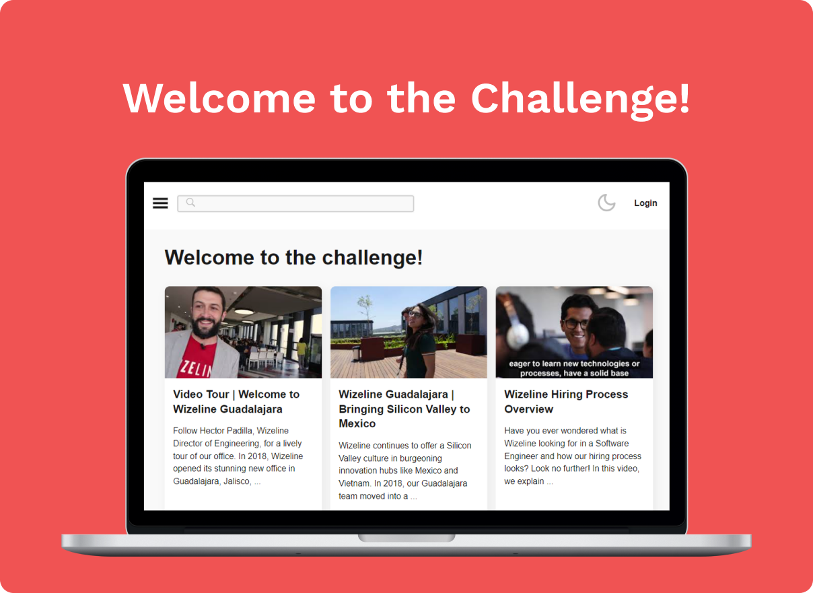

  

   

 

## 👋 Wizeline Academy - 2021 React Bootcamp

This is a wizeline academy project for 2021 react bootcamp. The challenge consisted on creating a youtube clone with the requirements specified on the following [GIST](https://gist.github.com/villacoder/9f980254461fa8bfbe93067db2126872).

## ✨Features

- **Dark/Light mode**, you can toggle them and it'll be saved on to your localStorage
- **Search bar**, you'll be able to search any video you'd like.
- **Sign in**, via auth0 you can sign in and access to restricted pages on the application, you can even sign in with google.
- **Recover password**, forgot your password? don't worry, you'll be able to recover it on the sign in page.
- **Favorite videos**, when signed in you can access the favorite video section of the app where you'll see all the favorite videos you have added.
- **404 page**, when trying to access a non existing route, it will pop out a 404 page.

## 🚀 Cloning

1. Fork repo
2. Install dependencies
3. Add enviroment variables for
   1. Auth0
   2. Youtube API
4. Use yarn start to run project locally
5. To watch tests run yarn test
6. To watch test coverage run yarn test:coverage
